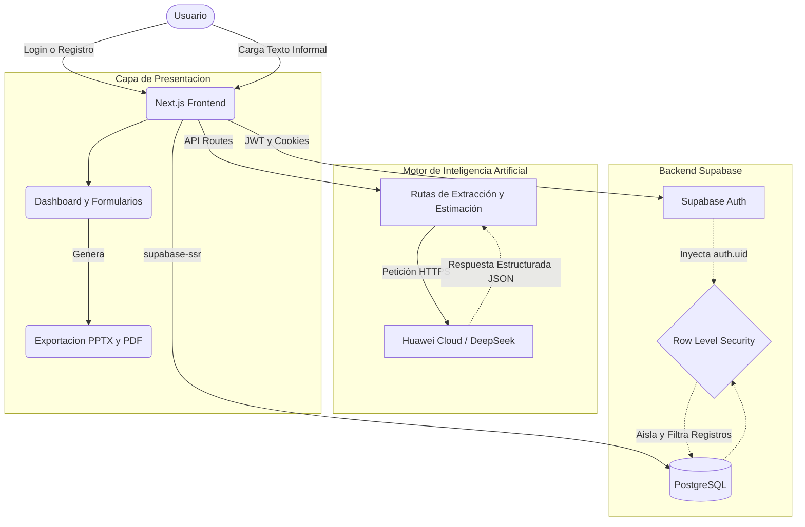

# Gestor de Portafolio de Iniciativas

Plataforma empresarial desarrollada para centralizar, gestionar y documentar las iniciativas estratégicas (ej. Claro VTR). Permite a múltiples usuarios tener su propio portafolio privado y aislado, potenciar la captura de información mediante **Inteligencia Artificial**, visualizar métricas en un dashboard interactivo, y exportar reportes ejecutivos.

## 🚀 Características Principales

* **Súper-Poderes de Inteligencia Artificial (DeepSeek LLM):**
  * **Autocompletar Inteligente:** Pega cualquier correo o descripción informal de un proyecto, y la IA extraerá y estructurará automáticamente la información en el formulario Canvas.
  * **Estimador de T-Shirt Sizing:** La IA lee tu problema y contexto, y te sugiere de manera automática los esfuerzos de tiempo, costo y niveles de incertidumbre técnica.
  * **Elevator Pitch Ejecutivo:** En un solo clic, la IA lee la iniciativa técnica y redacta un resumen persuasivo de 3 líneas enfocado puramente en el ROI para presentar a gerencia.
* **Sistema Multi-Tenant y Seguridad:** Cada usuario posee una cuenta privada. Sus datos están protegidos a nivel de base de datos usando Supabase Auth y RLS.
* **Trazabilidad y Colaboración:**
  * **Audit Log (Historial):** Registro automático de cada cambio de estado, edición o acción realizada en la iniciativa.
  * **Comentarios:** Hilo de discusión en tiempo real para cada iniciativa.
* **Exportación y Respaldos:** 
  * Exportación de documentos a **PDF** y **PPTX**.
  * Importación masiva (Upsert) y Exportación en formato **JSON**.
* **Modo Presentación:** Interfaz limpia sin distracciones (Modo TV) optimizada para proyectar en reuniones y comités.
* **Dashboard Analítico:** Gráficos y KPI's automáticos en tiempo real basados en el estado y marca de las iniciativas.

## 🛠️ Stack Tecnológico

* **Framework:** [Next.js](https://nextjs.org/) (App Router)
* **Estilos:** [Tailwind CSS](https://tailwindcss.com/)
* **Base de Datos & Auth:** [Supabase](https://supabase.com/) (PostgreSQL)
* **Inteligencia Artificial:** Huawei Cloud ModelArts (DeepSeek V3)
* **Testing:** Jest & React Testing Library
* **Gráficos:** Recharts

## 🏗️ Arquitectura del Sistema

El sistema utiliza **Row Level Security (RLS)** de PostgreSQL en conjunto con Supabase Auth para garantizar la privacidad de los datos, integrándose con ModelArts para la orquestación de prompts de Inteligencia Artificial.



## ⚙️ Configuración Local

1. Clona el repositorio e instala las dependencias:
```bash
npm install
```

2. Configura las variables de entorno creando un archivo `.env.local` en la raíz con tus credenciales de Supabase y de la IA:
```env
NEXT_PUBLIC_SUPABASE_URL=tu_url_de_supabase
NEXT_PUBLIC_SUPABASE_ANON_KEY=tu_anon_key_de_supabase

HUAWEI_LLM_URL=https://api-ap-southeast-1.modelarts-maas.com/v2/chat/completions
HUAWEI_LLM_API_KEY=tu_api_key_de_huawei_cloud
```

3. Inicia el servidor de desarrollo:
```bash
npm run dev
```

El proyecto estará disponible en `http://localhost:3000`.

## 🔒 Reglas de Base de Datos (RLS)

Para el correcto funcionamiento, las tablas en Supabase deben contar con políticas RLS vinculadas a `auth.users`:

```sql
ALTER TABLE public.initiatives ENABLE ROW LEVEL SECURITY;
ALTER TABLE public.initiative_history ENABLE ROW LEVEL SECURITY;
ALTER TABLE public.initiative_comments ENABLE ROW LEVEL SECURITY;

CREATE POLICY "Users can access their own initiatives" 
ON public.initiatives FOR ALL USING (auth.uid() = user_id);
```
